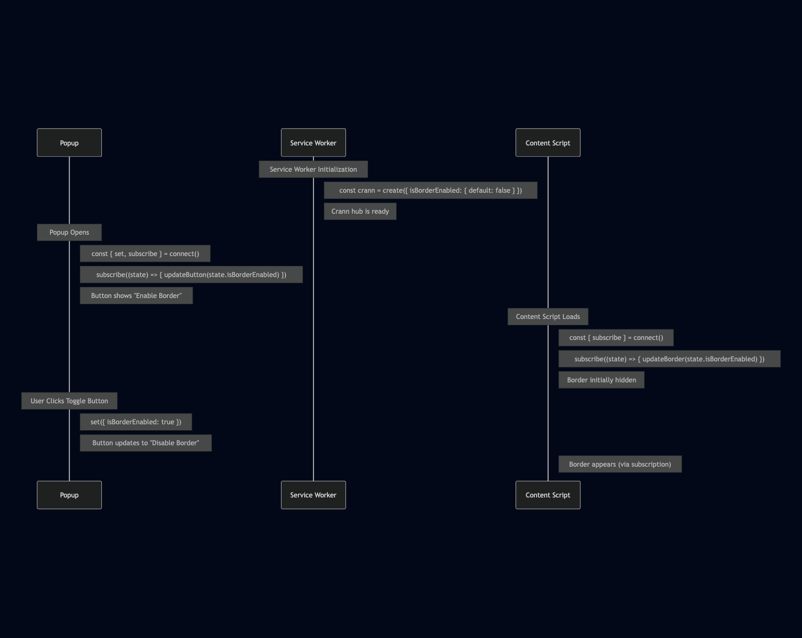

# Crann: Effortless State Synchronization for Web Extensions


`npm i crann`

## Table of Contents

- [Core Features](#core-features)
- [Quick Start](#quick-start)
- [Configuration](#configuration)
- [Store API (Service Worker)](#store-api-service-worker)
- [Agent API (Content Scripts, Popup, etc.)](#agent-api)
- [React Integration](#react-integration)
- [RPC Actions](#rpc-actions)
- [State Persistence](#state-persistence)
- [Migration from v1](#migration-from-v1)

## Core Features

- **Minimal size** (< 5kb gzipped)
- **Multi-context sync** - Content Scripts, Service Worker, Devtools, Sidepanels, Popup
- **No message boilerplate** - Eliminates `chrome.runtime.sendMessage` / `onMessage`
- **Reactive updates** - Subscribe to state changes
- **Persistence** - Optional local or session storage
- **Full TypeScript** - Complete type inference from config
- **React hooks** - First-class React integration via `crann/react`
- **RPC Actions** - Execute logic in the service worker from any context

## Quick Start

### 1. Define Your Config

```typescript
// config.ts
import { createConfig, Persist } from "crann";

export const config = createConfig({
  name: "myExtension",      // Required: unique store name
  version: 1,               // Optional: for migrations
  
  // Define your state
  isEnabled: { default: false },
  count: { default: 0, persist: Persist.Local },
  
  // Define actions (RPC)
  actions: {
    increment: {
      handler: async (ctx, amount: number = 1) => {
        return { count: ctx.state.count + amount };
      },
    },
  },
});
```

### 2. Initialize the Store (Service Worker)

```typescript
// service-worker.ts
import { createStore } from "crann";
import { config } from "./config";

const store = createStore(config);

store.subscribe((state, changes) => {
  console.log("State changed:", changes);
});
```

### 3. Connect from Any Context

```typescript
// popup.ts or content-script.ts
import { connectStore } from "crann";
import { config } from "./config";

const agent = connectStore(config);

agent.onReady(() => {
  console.log("Connected! Current state:", agent.getState());
  
  // Update state
  agent.setState({ isEnabled: true });
  
  // Call actions
  agent.actions.increment(5);
});
```

### 4. Use with React

```typescript
// hooks.ts
import { createCrannHooks } from "crann/react";
import { config } from "./config";

export const { useCrannState, useCrannActions, useCrannReady } = createCrannHooks(config);

// Counter.tsx
function Counter() {
  const count = useCrannState(s => s.count);
  const { increment } = useCrannActions();
  const isReady = useCrannReady();

  if (!isReady) return <div>Loading...</div>;

  return (
    <button onClick={() => increment(1)}>
      Count: {count}
    </button>
  );
}
```

## Configuration

The `createConfig` function defines your store schema:

```typescript
import { createConfig, Scope, Persist } from "crann";

const config = createConfig({
  // Required: unique identifier for this store
  name: "myStore",
  
  // Optional: version number for migrations (default: 1)
  version: 1,
  
  // State definitions
  count: { default: 0 },
  
  // With persistence
  theme: { 
    default: "light" as "light" | "dark",
    persist: Persist.Local,   // Persist.Local | Persist.Session | Persist.None
  },
  
  // Agent-scoped state (each tab/frame gets its own copy)
  selectedElement: {
    default: null as HTMLElement | null,
    scope: Scope.Agent,       // Scope.Shared (default) | Scope.Agent
  },
  
  // Actions (RPC handlers)
  actions: {
    doSomething: {
      handler: async (ctx, arg1: string, arg2: number) => {
        // ctx.state - current state
        // ctx.setState - update state
        // ctx.agentId - calling agent's ID
        return { result: "value" };
      },
      validate: (arg1, arg2) => {
        if (!arg1) throw new Error("arg1 required");
      },
    },
  },
});
```

## Store API (Service Worker)

The Store runs in the service worker and manages all state:

```typescript
import { createStore } from "crann";

const store = createStore(config, {
  debug: true,  // Enable debug logging
});

// Get current state
const state = store.getState();

// Update state
await store.setState({ count: 5 });

// Get agent-scoped state for a specific agent
const agentState = store.getAgentState(agentId);

// Subscribe to all state changes
const unsubscribe = store.subscribe((state, changes, agentInfo) => {
  console.log("Changed:", changes);
});

// Listen for agent connections
store.onAgentConnect((agent) => {
  console.log(`Agent ${agent.id} connected from tab ${agent.tabId}`);
});

store.onAgentDisconnect((agent) => {
  console.log(`Agent ${agent.id} disconnected`);
});

// Get all connected agents
const agents = store.getAgents();
const contentScripts = store.getAgents({ context: "contentscript" });

// Clear all state to defaults
await store.clear();

// Destroy the store (cleanup)
store.destroy();
// Or clear persisted data on destroy:
store.destroy({ clearPersisted: true });
```

## Agent API

Agents connect to the store from content scripts, popups, and other contexts:

```typescript
import { connectStore } from "crann";

const agent = connectStore(config, {
  debug: true,
});

// Wait for connection to be ready
agent.onReady(() => {
  console.log("Connected!");
});

// Or use the promise
await agent.ready();

// Get current state
const state = agent.getState();

// Update state
await agent.setState({ count: 10 });

// Subscribe to changes
const unsubscribe = agent.subscribe((changes, state) => {
  console.log("State changed:", changes);
});

// Call actions (RPC)
const result = await agent.actions.doSomething("arg1", 42);

// Get agent info
const info = agent.getInfo();
// { id, tabId, frameId, context }

// Handle disconnect/reconnect
agent.onDisconnect(() => console.log("Disconnected"));
agent.onReconnect(() => console.log("Reconnected"));

// Clean up
agent.disconnect();
```

## React Integration

Import from `crann/react` for React hooks:

```typescript
import { createCrannHooks } from "crann/react";
import { config } from "./config";

// Create hooks bound to your config
export const {
  useCrannState,
  useCrannActions,
  useCrannReady,
  useAgent,
  CrannProvider,
} = createCrannHooks(config);
```

### useCrannState

Two patterns for reading state:

```typescript
// Selector pattern - returns selected value
const count = useCrannState(s => s.count);
const theme = useCrannState(s => s.settings.theme);

// Key pattern - returns [value, setValue] tuple
const [count, setCount] = useCrannState("count");
setCount(10); // Updates state
```

### useCrannActions

Returns typed actions with stable references (won't cause re-renders):

```typescript
const { increment, fetchData } = useCrannActions();

// Actions are async
await increment(5);
const result = await fetchData("https://api.example.com");
```

### useCrannReady

Check connection status:

```typescript
const isReady = useCrannReady();

if (!isReady) {
  return <LoadingSpinner />;
}
```

### CrannProvider (Optional)

For testing or dependency injection:

```typescript
// In tests
const mockAgent = createMockAgent();

render(
  <CrannProvider agent={mockAgent}>
    <MyComponent />
  </CrannProvider>
);
```

## RPC Actions

Actions execute in the service worker but can be called from any context:

```typescript
// In config
const config = createConfig({
  name: "myStore",
  count: { default: 0 },
  
  actions: {
    increment: {
      handler: async (ctx, amount: number = 1) => {
        const newCount = ctx.state.count + amount;
        // Option 1: Return state updates
        return { count: newCount };
        
        // Option 2: Use ctx.setState
        // await ctx.setState({ count: newCount });
        // return { success: true };
      },
    },
    
    fetchUser: {
      handler: async (ctx, userId: string) => {
        // Runs in service worker - can make network requests
        const response = await fetch(`/api/users/${userId}`);
        const user = await response.json();
        return { user };
      },
      validate: (userId) => {
        if (!userId) throw new Error("userId required");
      },
    },
  },
});

// From any context (popup, content script, etc.)
const agent = connectStore(config);
await agent.ready();

const result = await agent.actions.increment(5);
console.log(result.count); // 5

const { user } = await agent.actions.fetchUser("123");
console.log(user.name);
```

### ActionContext

Action handlers receive a context object:

```typescript
interface ActionContext<TState> {
  state: TState;                                    // Current state snapshot
  setState: (partial: Partial<TState>) => Promise<void>;  // Update state
  agentId: string;                                  // Calling agent's ID
  agentLocation: BrowserLocation;                   // Tab/frame info
}
```

## State Persistence

Control how state is persisted:

```typescript
import { createConfig, Persist } from "crann";

const config = createConfig({
  name: "myStore",
  
  // No persistence (default) - resets on service worker restart
  volatile: { default: null },
  
  // Local storage - persists across browser sessions
  preferences: { 
    default: { theme: "light" },
    persist: Persist.Local,
  },
  
  // Session storage - persists until browser closes
  sessionData: {
    default: {},
    persist: Persist.Session,
  },
});
```

### Storage Keys

Crann uses structured storage keys: `crann:{name}:v{version}:{key}`

This prevents collisions and enables clean migrations.

## Migration from v1

### Key Changes

| v1 | v2 |
|----|----|
| `create()` | `createStore()` |
| `connect()` | `connectStore()` |
| `Partition.Instance` | `Scope.Agent` |
| `Partition.Service` | `Scope.Shared` |
| `crann.set()` | `store.setState()` |
| `crann.get()` | `store.getState()` |
| `callAction("name", arg)` | `agent.actions.name(arg)` |
| Config object literal | `createConfig()` |

### Migration Steps

1. **Update config to use `createConfig()`:**

```typescript
// Before (v1)
const crann = create({
  count: { default: 0 },
});

// After (v2)
const config = createConfig({
  name: "myStore",  // Required in v2
  count: { default: 0 },
});

const store = createStore(config);
```

2. **Update terminology:**

```typescript
// Before (v1)
partition: Partition.Instance

// After (v2)
scope: Scope.Agent
```

3. **Update React hooks:**

```typescript
// Before (v1)
import { useCrann } from "crann";
const { get, set, callAction } = useCrann();

// After (v2)
import { createCrannHooks } from "crann/react";
const { useCrannState, useCrannActions } = createCrannHooks(config);
```

4. **Update action calls:**

```typescript
// Before (v1)
await callAction("increment", 5);

// After (v2)
await agent.actions.increment(5);
```

## Why Crann?

Browser extensions have multiple isolated contexts that need to share state:

- **Service Worker** - Background logic and events
- **Content Scripts** - Injected into web pages
- **Popup** - Extension icon click UI
- **Side Panels, DevTools** - Other specialized contexts

Traditionally, this requires complex `chrome.runtime.sendMessage` / `onMessage` patterns. Crann eliminates this boilerplate by providing a central state hub that all contexts can connect to.



---

**License:** ISC

**Repository:** [github.com/moclei/crann](https://github.com/moclei/crann)
